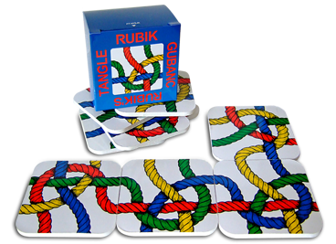

# Rubik's Tangle
The Rubik's Tangle is a logic game consisting of 9 small cardboard tiles.  
These cardboard tiles (the more modern ones are made of plastic) are double-sided, so we have a total of 18 figures.
Each figure shows 4 threads of different colors, which are entangled with each other.
Each figure looks the same, except that the colors of the threads are different.
The goal of the game is to place these nine cardboard tiles in such a way that the colors of the threads are continuous, and the whole forms a 3x3 square. 
The cards can be placed in a total of 95,126,813,710 ways. 

